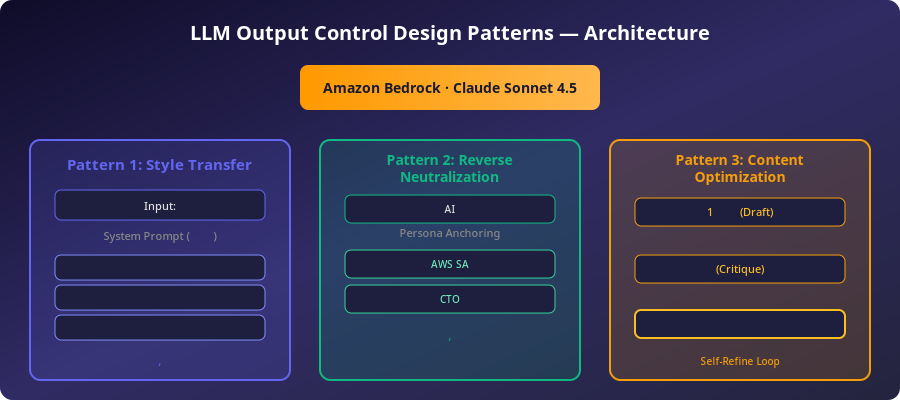
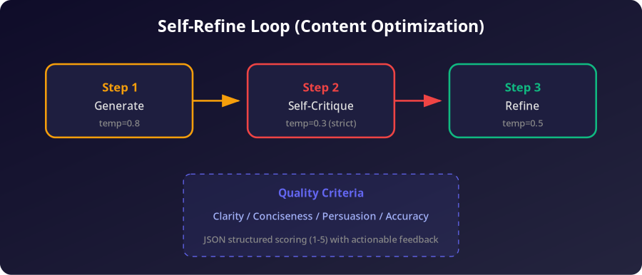

# LLM Output Control Design Patterns Demo

LLM 출력 제어 디자인 패턴을 <strong>Amazon Bedrock Claude Sonnet 4.5 (Global Inference)</strong>로 구현한 데모입니다.

> Reference: [Generative AI Design Patterns](https://www.oreilly.com/library/view/generative-ai-design/9798341622654/) — Lakshmanan & Hapke, O'Reilly 2025
>
> Blog: [LLM 출력 제어 디자인 패턴 1편](https://jesamkim.github.io/ai-tech-blog/posts/2026-02-18-llm-%EC%B6%9C%EB%A0%A5-%EC%A0%9C%EC%96%B4-%EB%94%94%EC%9E%90%EC%9D%B8-%ED%8C%A8%ED%84%B4-logits-masking%EB%B6%80%ED%84%B0-grammar-constraint-style-t/) | [2편](https://jesamkim.github.io/ai-tech-blog/posts/2026-02-18-llm-%EC%B6%9C%EB%A0%A5-%EC%A0%9C%EC%96%B4-%EB%94%94%EC%9E%90%EC%9D%B8-%ED%8C%A8%ED%84%B4-2%ED%8E%B8-reverse-neutralization%EA%B3%BC-content-optimiza/)



## Architecture

```
demo.py                          # CLI entry point (argparse)
  |
  +-- patterns/
  |     +-- __init__.py          # public exports
  |     +-- bedrock.py           # Bedrock Converse API client
  |     +-- metrics.py           # evaluation utilities (LLM-as-Judge, text metrics)
  |     +-- display.py           # table formatter, OutputCollector (JSON/save)
  |     +-- style_transfer.py    # Pattern 1
  |     +-- reverse_neutralization.py  # Pattern 2
  |     +-- content_optimization.py    # Pattern 3
  |
  +-- results/                   # auto-saved JSON results (--save)
  +-- images/                    # architecture diagrams
```

**Data flow:**

1. `demo.py`가 argparse로 CLI 인자를 파싱 (pattern, --advanced, --output, --save, --model)
2. 선택된 패턴 모듈의 `demo_*()` 함수를 호출
3. 각 모듈은 `bedrock.py`의 `call_bedrock()`으로 LLM 호출, `metrics.py`로 평가
4. `display.py`의 `OutputCollector`가 모든 결과를 수집
5. `--output json`이면 JSON stdout, `--save`이면 `results/`에 타임스탬프별 저장

## Quick Start

```bash
pip install boto3

# Basic mode
python3 demo.py 1               # Style Transfer
python3 demo.py 2               # Reverse Neutralization
python3 demo.py 3               # Content Optimization
python3 demo.py all             # Run all

# Advanced mode (more scenarios + metrics)
python3 demo.py 1 --advanced
python3 demo.py all --advanced

# JSON output
python3 demo.py 1 --output json

# Save results to results/
python3 demo.py all --advanced --save

# Override model
python3 demo.py 1 --model global.anthropic.claude-sonnet-4-5-20250929-v1:0

# Compare multiple models
COMPARE_MODELS=model-a,model-b python3 demo.py 1 --advanced
```

### <strong>환경변수</strong>

| Variable | Default | Description |
|----------|---------|-------------|
| `BEDROCK_MODEL_ID` | `global.anthropic.claude-sonnet-4-5-20250929-v1:0` | Bedrock model ID |
| `BEDROCK_REGION` | `us-west-2` | AWS region |
| `COMPARE_MODELS` | _(empty)_ | <strong>비교 모드</strong>: 쉼표로 구분된 model ID 목록 |

## Patterns

### Pattern 1: Style Transfer — <strong>톤/문체 변환</strong>

같은 입력에 System Prompt만 바꿔서 다른 톤으로 변환합니다. 콘텐츠(의미)는 보존하고 스타일만 변경합니다.

**Basic mode** — 3 styles (IT Incident):

| Style | Output (sample) |
|-------|-----------------|
| Business Formal | "Server failure has been reported. Immediate investigation is requested..." |
| Technical Incident Report | "Incident Report — Recurring server failure, root cause analysis required" |
| Friendly Customer Service | "We sincerely empathize with the inconvenience you're experiencing..." |

**Advanced mode** — 7+ styles + 3 scenarios + metrics:
- Medical Opinion, Legal Opinion, Emotion MAX/MIN, Executive Summary
- Scenarios: IT Incident, Medical Consultation, Security Incident
- LLM-as-Judge <strong>의미 보존도</strong> 자동 평가 (1-5)

```
  Style Transfer Metrics
+-------------+------------------+------+-------+---------+--------+-----------+------+
| Scenario    | Style            | Orig | Trans | Preserv | NoDist | ToneShift | Time |
+-------------+------------------+------+-------+---------+--------+-----------+------+
| IT Incident | Business Formal  | 39   | 61    | 5       | 5      | 5         | 2.1s |
| IT Incident | Tech Report      | 39   | 173   | 5       | 5      | 5         | 3.4s |
| IT Incident | Legal Opinion    | 39   | 455   | 5       | 4      | 5         | 4.2s |
| IT Incident | Emotion MAX      | 39   | 333   | 5       | 4      | 5         | 2.8s |
| Security    | Executive Summary| 52   | 198   | 5       | 5      | 5         | 2.5s |
+-------------+------------------+------+-------+---------+--------+-----------+------+
```

### Pattern 2: Reverse Neutralization — <strong>도메인 전문가 페르소나</strong>

RLHF 정렬로 인해 중립적인 답변만 하는 LLM을, 도메인 전문가의 관점으로 전환합니다.

**Basic mode** — 2 personas:

| Persona | Characteristics |
|---------|----------------|
| AWS SA (10yr) | Real-world experience, specific service names, failure cases |
| Startup CTO | Realistic cost/headcount analysis, "what's possible now" |

**Advanced mode** — 6 personas + 2 questions:
- Security Expert (CISO) — threat modeling, zero-trust, breach cases
- Data Scientist — A/B tests, statistical significance, MLOps
- Regulatory Consultant — financial regulation, CSAP, penalty quantification
- DevOps Lead — CI/CD, observability, MTTR, tooling trade-offs
- Questions: Cloud migration (financial sector) + Monolith-to-microservices

```
  Reverse Neutralization Metrics (Advanced)
+----------------------+---------------+------------+------+
| Persona              | Length(chars) | AvgSentLen | Time |
+----------------------+---------------+------------+------+
| Neutral AI           | 284           | 12.3       | 1.8s |
| AWS Solutions Archit | 1523          | 18.7       | 5.2s |
| Startup CTO          | 987           | 14.2       | 4.1s |
| Security Expert (CIS | 1834          | 21.5       | 6.3s |
| Data Scientist       | 1245          | 16.8       | 4.8s |
| Regulatory Consultan | 1678          | 19.3       | 5.9s |
| DevOps Lead          | 1356          | 17.1       | 5.0s |
+----------------------+---------------+------------+------+
```

### Pattern 3: Content Optimization — Self-Refine <strong>루프</strong>

생성 -> 자기 평가 -> 피드백 반영 재생성의 반복 루프로 품질을 체계적으로 개선합니다.



**Basic mode** — 1 round:
- 4 criteria (Clarity, Conciseness, Persuasiveness, Accuracy)
- Generate -> Critique -> Refine x1

**Advanced mode** — 3 rounds + 2 tasks:
- Financial CIO Proposal (6 criteria incl. Security/Regulation, Feasibility)
- Tech Blog Introduction (5 criteria incl. Tone)
- Round-by-round score progression table

```
  Score Progression (Financial CIO Proposal Summary)
+-------+------+------+------+------+--------+--------+-----+
| Round | 명확성 | 간결성 | 설득력 | 정확성 | 보안/규제 | 실행가능성 | AVG |
+-------+------+------+------+------+--------+--------+-----+
| R1    | 4    | 3    | 4    | 4    | 3      | 3      | 3.5 |
| R2    | 4    | 4    | 5    | 5    | 4      | 4      | 4.3 |
| R3    | 5    | 5    | 5    | 5    | 4      | 5      | 4.8 |
| Final | 5    | 5    | 5    | 5    | 5      | 5      | 5.0 |
+-------+------+------+------+------+--------+--------+-----+
  Improvement: 3.5 -> 5.0 (+1.5)
```

## Model

| | |
|---|---|
| **Model** | Claude Sonnet 4.5 |
| **Model ID** | `global.anthropic.claude-sonnet-4-5-20250929-v1:0` |
| **API** | Amazon Bedrock Converse API |
| **Inference** | Global Inference (cross-region) |

## Project Structure

```
output-control-patterns-demo/
├── demo.py                           # CLI entry point
├── patterns/
│   ├── __init__.py                   # public exports
│   ├── bedrock.py                    # Bedrock client + model management
│   ├── metrics.py                    # text metrics + LLM-as-Judge
│   ├── display.py                    # table formatter + OutputCollector
│   ├── style_transfer.py            # Pattern 1: Style Transfer
│   ├── reverse_neutralization.py    # Pattern 2: Reverse Neutralization
│   └── content_optimization.py      # Pattern 3: Content Optimization
├── results/                          # auto-saved JSON results (--save)
├── images/
│   ├── architecture.png
│   └── self-refine-loop.png
└── README.md
```

## Metrics

Advanced <strong>모드에서</strong> 자동 산출되는 메트릭:

| Pattern | Metric | Method |
|---------|--------|--------|
| Style Transfer | <strong>의미 보존도</strong> (1-5) | LLM-as-Judge |
| Style Transfer | <strong>텍스트 길이</strong> 변화 | char count comparison |
| Style Transfer | <strong>실행 시간</strong> | per-style elapsed time |
| Reverse Neutralization | <strong>응답 길이/복잡도</strong> | chars + avg sentence length |
| Reverse Neutralization | <strong>실행 시간</strong> | per-persona elapsed time |
| Content Optimization | <strong>라운드별 점수</strong> 추이 | JSON auto-parsing |
| Content Optimization | <strong>개선도</strong> | first round vs final avg delta |

## JSON Output

`--output json` <strong>플래그로</strong> 구조화된 결과를 얻을 수 있습니다:

```json
{
  "model_id": "global.anthropic.claude-sonnet-4-5-20250929-v1:0",
  "timestamp": "2026-02-18T14:30:00",
  "patterns": [
    {
      "pattern": "style_transfer",
      "advanced": false,
      "scenarios": [
        {
          "scenario": "IT Incident Report",
          "label": "Business Formal",
          "input": "서버가 또 터졌어요...",
          "output": "서버 장애가 발생하였습니다...",
          "elapsed_sec": 2.1,
          "metrics": {"preservation": 5, "no_distortion": 5, "tone_shift": 5}
        }
      ]
    }
  ]
}
```

## References

1. Lakshmanan, V. & Hapke, H. (2025). *Generative AI Design Patterns.* O'Reilly Media.
2. Madaan, A., et al. (2023). *Self-Refine: Iterative Refinement with Self-Feedback.* [arXiv:2303.17651](https://arxiv.org/abs/2303.17651)
3. Ouyang, L., et al. (2022). *Training language models to follow instructions with human feedback.* [arXiv:2203.02155](https://arxiv.org/abs/2203.02155)
4. Reif, E., et al. (2022). *A Recipe for Arbitrary Text Style Transfer with Large Language Models.* ACL 2022.
5. Zheng, L., et al. (2023). *Judging LLM-as-a-Judge.* [arXiv:2306.05685](https://arxiv.org/abs/2306.05685)

## Contributing

<strong>기여 방법</strong>:

1. Fork this repository
2. Create a feature branch (`git checkout -b feature/new-pattern`)
3. <strong>새 패턴</strong> 추가 시:
   - `patterns/` 디렉토리에 새 모듈 생성
   - `demo_<pattern_name>(advanced, json_mode)` 함수 구현
   - `patterns/__init__.py`에 export 추가
   - `demo.py`의 `DEMOS` dict에 등록
4. <strong>새 시나리오</strong> 추가 시:
   - 해당 패턴 모듈의 `SCENARIOS` 또는 `TASKS` dict에 추가
5. Commit and push (`git push origin feature/new-pattern`)
6. Create a Pull Request

### <strong>코드 컨벤션</strong>

- Python 3.10+
- Type hints for function signatures
- Docstrings for public functions
- `call_bedrock()` for all LLM calls (via `patterns.bedrock`)
- `OutputCollector`에 결과 수집 (`collector.add_result()`)
